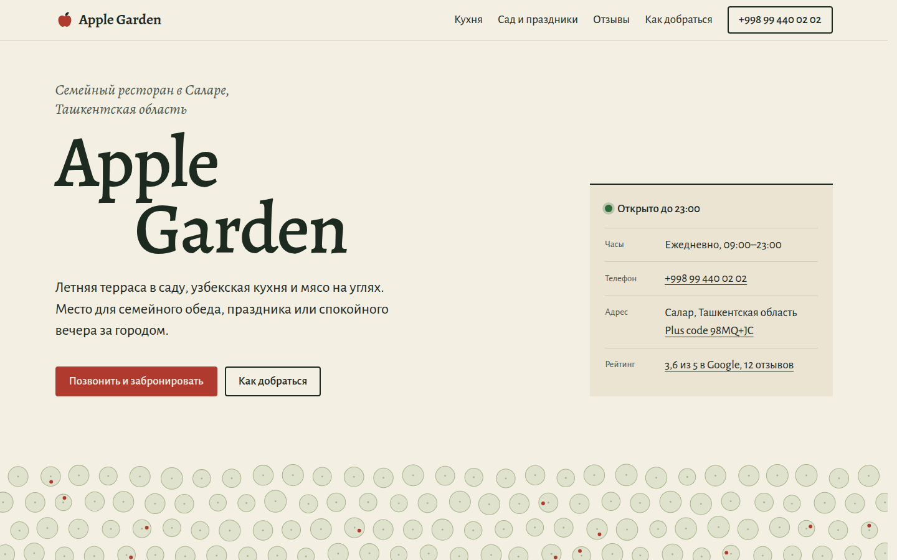
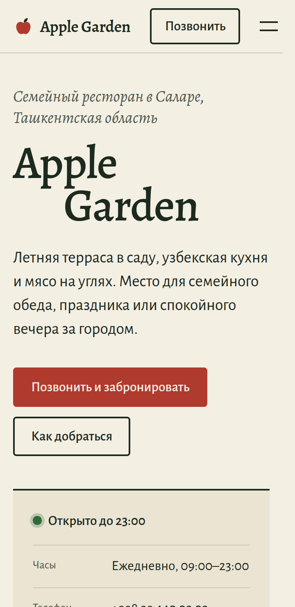
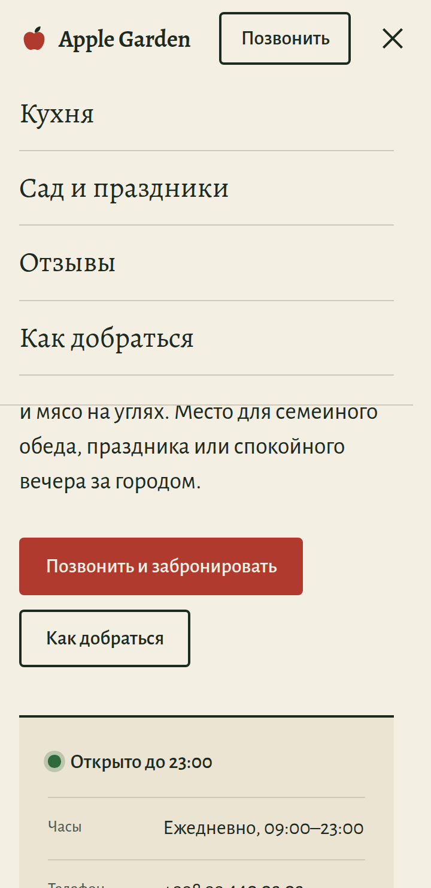
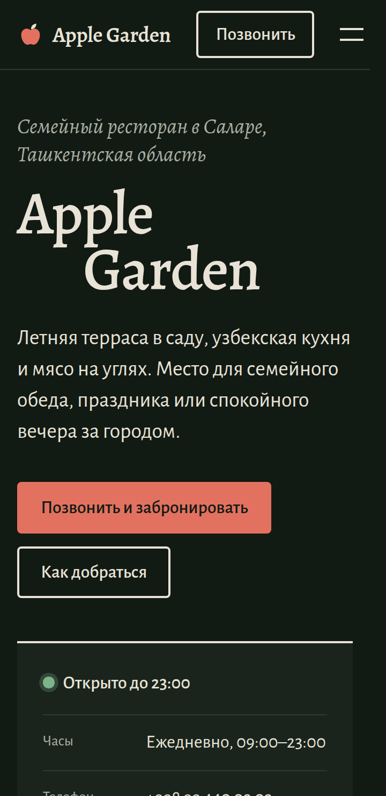
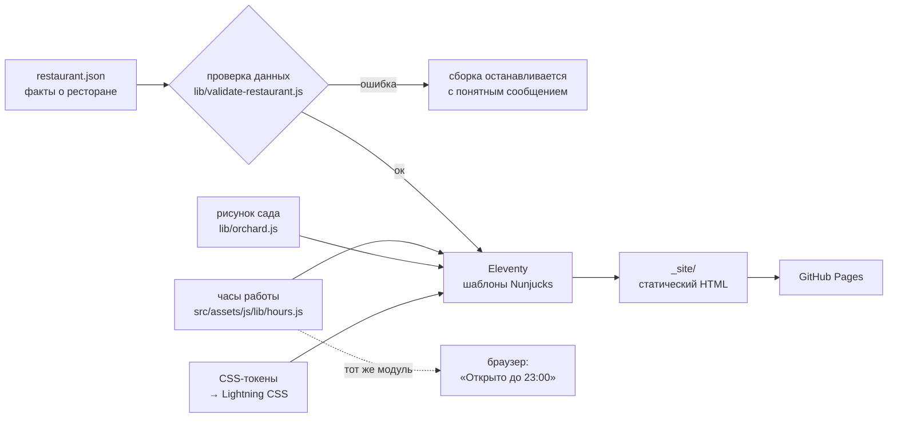

# Apple Garden

[](https://github.com/Meewe123/apple-garden/actions/workflows/ci.yml)

Сайт семейного ресторана в Саларе под Ташкентом. Сразу показывает, открыт ли ресторан, как туда позвонить и доехать.

**Демо:** https://meewe123.github.io/apple-garden/

> Это неофициальный концепт, учебный проект для портфолио. Ресторан сайт не заказывал. Факты о ресторане взяты из его открытой карточки в Google Maps.



|                            Телефон                             |                      Меню на телефоне                       |                   Тёмная тема                    |
| :------------------------------------------------------------: | :---------------------------------------------------------: | :----------------------------------------------: |
|  |  |  |

<details>
<summary>In English</summary>

A concept website for Apple Garden, a family restaurant near Tashkent, Uzbekistan. It is a fast static page that answers what visitors actually come for: is it open right now, how to call, how to get there. Built with Eleventy from a single validated data file. Includes a live opening-hours status computed in the restaurant's time zone, a click-to-load map, light and dark themes, unit and browser tests with automated WCAG 2.2 AA checks, and Lighthouse CI. Unofficial: the restaurant did not commission it.

</details>

## Возможности

- **«Открыто до 23:00»** прямо на первом экране. Статус считается по ташкентскому времени, где бы ни находился посетитель, и обновляется каждую минуту. Вечером он сменится на «Скоро закроется», ночью — на «Закрыто, откроется завтра в 09:00».
- **Позвонить можно с любого места страницы:** кнопка в шапке видна всегда, на телефоне тоже.
- **Как добраться:** маршрут в Google Maps и в Яндекс Картах ведёт в одну и ту же точку (координаты вычислены из plus code). Адрес с координатами можно скопировать для такси одной кнопкой.
- **Карта Google загружается только по кнопке.** Так страница открывается быстрее и не передаёт данные Google без спроса. Пока карта грузится, показан скелетон; если она не загрузилась, появляется понятная ошибка и кнопка «Попробовать ещё раз».
- **Честные отзывы.** Рейтинг показан как есть (3,6, а не округлённые четыре звезды), цитаты дословные, имена авторов сокращены.
- **Тёмная тема** включается по настройке системы.
- **Работает без JavaScript:** скрипты только добавляют удобства, вся информация есть в HTML.
- **Продуманные мелочи:** страница 404, превью ссылки для мессенджеров и соцсетей, данные schema.org для поисковиков, видимый фокус для навигации с клавиатуры, ссылка «Перейти к содержанию».

## Как это устроено

Все факты о ресторане хранятся в одном файле: [`src/_data/restaurant.json`](src/_data/restaurant.json). Это телефон, адрес, часы, кухня, рейтинг и отзывы. Перед сборкой файл проверяется. Если номер телефона или время записаны с ошибкой, сборка останавливается и пишет, что именно не так. Из этого же файла собираются страницы, разметка для поисковиков и данные для статуса «открыто».



Логика часов работы ([`hours.js`](src/assets/js/lib/hours.js)) написана один раз и работает в двух местах. При сборке она формирует строку «Ежедневно, 09:00–23:00», в браузере считает живой статус. Модуль учитывает часы после полуночи, выходные дни и часовой пояс ресторана, и всё это покрыто тестами.

### Дизайн

- **Сначала информация.** Человек открывает сайт ресторана, чтобы узнать, открыто ли, где это и как позвонить. Поэтому всё это есть на первом экране.
- **Типографика вместо декора.** Шрифты Alegreya и Alegreya Sans — одна гарнитура в двух стилях, с полноценной кириллицей и латиницей. Подгружаются с самого сайта, без сторонних серверов.
- **Одна палитра с одним акцентом:** бумажный фон, зелёно-чёрный текст и яблочно-красный акцент. Все цвета, размеры, отступы и длительности анимаций вынесены в токены ([`_tokens.css`](src/assets/css/_tokens.css)), тёмная тема просто переопределяет их.
- **Без фальшивых фотографий.** Настоящих снимков нет, поэтому нет и «галереи». Единственная иллюстрация — план сада сверху: ряды деревьев и несколько яблок. Он генерируется при сборке ([`orchard.js`](lib/orchard.js)) и каждый раз выглядит одинаково. На странице 404 в этом саду не хватает пары деревьев.
- **Асимметричная сетка из 12 колонок:** заголовок слева, содержание справа, одна пустая колонка между ними.

## Стек

| Задача           | Инструмент                                                                                              |
| ---------------- | ------------------------------------------------------------------------------------------------------- |
| Сборка           | [Eleventy 3](https://www.11ty.dev/), шаблоны Nunjucks                                                   |
| Стили            | CSS с токенами, сборка и минификация через [Lightning CSS](https://lightningcss.dev/)                   |
| Скрипты          | JavaScript-модули без фреймворков, типы в JSDoc проверяются TypeScript                                  |
| Юнит-тесты       | встроенный `node:test`                                                                                  |
| Браузерные тесты | [Playwright](https://playwright.dev/) и [axe-core](https://github.com/dequelabs/axe-core) (WCAG 2.2 AA) |
| Качество         | ESLint, Stylelint, Prettier, html-validate, Lighthouse CI                                               |
| CI/CD            | GitHub Actions → GitHub Pages, Dependabot                                                               |

## Запуск

Нужен [Node.js](https://nodejs.org/) 22 или новее.

```sh
npm ci            # установить зависимости
npm run dev       # сайт с автообновлением: http://localhost:8080/apple-garden/
```

| Команда               | Что делает                                                                                         |
| --------------------- | -------------------------------------------------------------------------------------------------- |
| `npm run build`       | собирает сайт в `_site/`                                                                           |
| `npm run preview`     | показывает собранный сайт так, как его отдаёт GitHub Pages: http://localhost:4173/apple-garden/    |
| `npm test`            | юнит-тесты                                                                                         |
| `npm run test:e2e`    | браузерные тесты и проверка доступности (перед первым запуском: `npx playwright install chromium`) |
| `npm run check`       | линтеры, проверка типов, юнит-тесты, сборка и валидация HTML — то же, что в CI                     |
| `npm run format`      | приводит код к единому стилю                                                                       |
| `npm run images`      | перерисовывает превью для соцсетей и иконку                                                        |
| `npm run screenshots` | обновляет скриншоты для этого README                                                               |

Адрес сайта и путь задаются переменными `SITE_URL` и `PATH_PREFIX`, примеры — в [`.env.example`](.env.example). Секретов у проекта нет.

## Проверки

Каждый push проходит через [GitHub Actions](.github/workflows/ci.yml):

1. ESLint, Stylelint, Prettier, проверка типов.
2. 52 юнит-теста: часы работы и часовые пояса, проверка данных, ссылки на карты, склонения, экранирование JSON, генерация рисунка.
3. Сборка, валидация HTML и `npm audit`.
4. 60 браузерных тестов на ширине 1280 и 360 px. Среди них статус в разное время суток (и для посетителя из другого часового пояса), меню с клавиатуры, загрузка и ошибка карты, копирование адреса, работа с выключенным JavaScript и axe-проверки в светлой и тёмной темах.
5. Lighthouse CI: сборка падает, если любая оценка ниже 90 (доступность — ниже 95).

Последний локальный замер Lighthouse — 100 / 100 / 100 / 100 (производительность, доступность, лучшие практики, SEO) для мобильной и десктопной версий.

## Структура

```text
src/
  _data/restaurant.json     все факты о ресторане — менять здесь
  _data/site.js             адрес сайта, язык
  _includes/                общий макет, шапка, подвал, звёзды рейтинга
  index.njk, 404.njk        страницы
  robots.njk, sitemap.njk   служебные файлы для поисковиков
  assets/css/               токены, база, сетка, компоненты, секции
  assets/js/                меню, статус «открыто», карта, копирование
  assets/js/lib/hours.js    логика часов работы (общая для сборки и браузера)
  assets/img/               иконки и превью для соцсетей
lib/                        код сборки: проверка данных, ссылки, schema.org, рисунок сада
scripts/                    локальный сервер, генерация картинок и скриншотов
tests/unit/                 юнит-тесты (node:test)
tests/e2e/                  браузерные тесты и проверки доступности (Playwright)
docs/screenshots/           скриншоты для README
```

## Как поменять данные

Откройте [`src/_data/restaurant.json`](src/_data/restaurant.json) прямо на GitHub и нажмите на карандаш. Например, чтобы поменять часы работы, исправьте `"opens"` и `"closes"`. Дни недели записываются числами, 1 — понедельник. После сохранения CI проверит файл, а сайт обновится сам.

## Ограничения

- Сайт неофициальный: часы и телефон перед поездкой лучше уточнить по телефону.
- Меню с ценами и фотографий нет, потому что их нет в открытых источниках. Выдумывать их не стали.
- Рейтинг и отзывы — снимок на момент создания сайта. Актуальные данные открываются по ссылке на Google Maps.

## Лицензия

Код распространяется по лицензии [MIT](LICENSE). Шрифты Alegreya и Alegreya Sans — по лицензии SIL Open Font License 1.1. Название Apple Garden и сведения о ресторане принадлежат ресторану.
